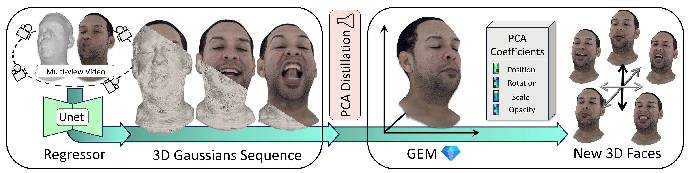

<h2 align="center"><b>GEM - Gaussian Eigen Models for Human Heads</b></h2>

<h4 align="center"><b><a href="https://zielon.github.io/" target="_blank">Wojciech Zielonka</a>, <a href="https://sites.google.com/site/bolkartt/" target="_blank">Timo Bolkart</a>, <a href="https://thabobeeler.com/" target="_blank">Thabo Beeler</a>, <a href="https://justusthies.github.io/" target="_blank">Justus Thies</a></b></h4>

<h6 align="center"><i>Max Planck Institute for Intelligent Systems, TU Darmstadt, Google</i></h6>

<h4 align="center">
<a href="https://youtu.be/sgG4K4I1TGw" target="_blank">📺 Video&nbsp</a>
<a href="http://arxiv.org/abs/2407.04545" target="_blank">📄 Paper&nbsp</a>
<a href="https://zielon.github.io/gem/" target="_blank">🌐 Project Website&nbsp</a>
</h4>

<div align="center"> 

<i style="font-size: 1.05em;">Official Repository for CVPR 2025 paper GEM - Gaussian Eigen Models for Human Heads</i>
</div>
<br>

This repository provides code for the GEM pipeline. It includes a high-quality regressor, which can be thought of as a self-contained Gaussian Avatar, as it is fully controllable using the FLAME model. The output from this regressor is then compressed into the GEM model. You can use either the CNN regressor or the distilled GEM version of it in your experiments.

### Installation

To install GEM, first clone the repository and then create the environment using the following commands:

```
git clone --recursive https://github.com/Zielon/GEM.git
cd GEM
```

After the repository is cloned with all the submodules, we can create the environment and install the libraries using `install.sh`.

```
yes Y | conda create -n gem python=3.9
conda activate gem
./install.sh
```

### Data preparation

We used [VHAP](https://github.com/ShenhanQian/VHAP) for tracking the [Nersemble](https://github.com/tobias-kirschstein/nersemble-data) dataset. Importantly, our pipeline requires **removing garments and the neck**. Follow the `render_masks.py` file to render an alpha mask without the neck. To remove garments, you can use an off-the-shelf segmentation network like [Face Parsing](https://github.com/zllrunning/face-parsing.PyTorch).

We used FLAME2023 and FLAME2020 in our experiments. Follow the [download instructions](https://flame.is.tue.mpg.de/) and place the model under: 
```
gem/data/FLAME2023/flame2023.pkl
gem/lib/F3DMM/FLAME2023/assets/flame2023.pkl
gem/lib/F3DMM/FLAME2020/assets/FLAME_2020.pkl
```

### Pretrained models

We additionally release all trained models for three actors. You can simply use the script `./checkpoints.sh` to automatically download them into the `experiments` folder. You will find all the checkpoints and the results of the test scripts there.

### How To Use

Our pipeline requires running a few scripts:

1) Generating PCA for input meshes  
2) Training the Gaussian texture regressor  
3) Building GEM  
4) Training the mapping network for coefficients  

See `run.sh` for reference how the pipeline is executed.

Below, you can see how each of these steps is executed.

#### Activate environment

```bash
conda activate gem
export VOL_TRACKER_PATH=$PWD
```

#### Generating PCA for input meshes  
```bash
# PCA for input meshes  
python pca_mesh.py
```

#### Training the Gaussian texture regressor  
```bash
# Training the Gaussian texture regressor  
python train.py configs/nersemble/253/default.yml

# Testing the Gaussian texture regressor  
python test.py configs/nersemble/253/default.yml
```

#### Building GEM  

See GEM [configuration](https://github.com/Zielon/GEM/blob/main/pca_gauss.py#L155).

```bash
# Building GEM  
python pca_gauss.py configs/nersemble/253/default.yml

# Visualize obtained GEM
python pca_viewer.py configs/nersemble/253/default.yml
```

#### Training the mapping network for coefficients

```bash
# Training the mapping network for coefficients  
python train.py configs/regressor/253/regressor_gem.yml

# Testing the mapping network for coefficients  
python test.py configs/regressor/253/regressor_gem.yml

# Reeanacment
python test.py configs/regressor/253/regressor_gem.yml configs/regressor/306/regressor_gem.yml
```

### Citation
If you use this project in your research please cite GEM:
```bibtex
@proceedings{zielonka2025gem,
  title={Gaussian Eigen Models for Human Heads},
  author = {Zielonka, Wojciech and Bolkart, Timo and Beeler Thabo, and Thies, Justus},
  booktitle = {Proceedings of the IEEE/CVF Conference on Computer Vision and Pattern Recognition (CVPR)},
  month = {June},
  year={2025},
}
```
